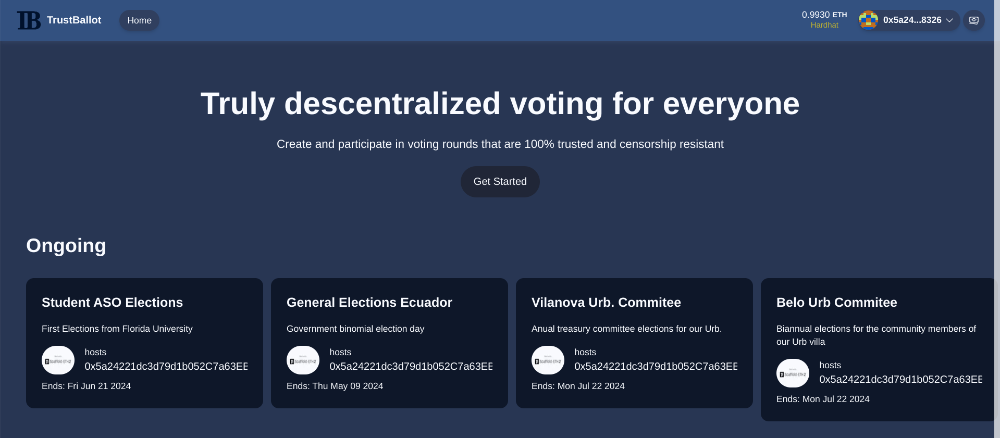

# 🏗 TrustBallot

A trusted voting rounds platform where results can be verified in the blockchain and all votes are private.

⚙️ Built using Scaffold ETH 2, with NextJS, RainbowKit, Hardhat, Wagmi, Viem, and Typescript.



## Requirements

Before you begin, you need to install the following tools:

- [Node (>= v18.17)](https://nodejs.org/en/download/)
- Yarn ([v1](https://classic.yarnpkg.com/en/docs/install/) or [v2+](https://yarnpkg.com/getting-started/install))
- [Git](https://git-scm.com/downloads)

## Quickstart

To get started with Scaffold-ETH 2, follow the steps below:

1. Install dependencies if it was skipped in CLI:

```
cd trustballot
yarn install
```

2. Run a local network in the first terminal:

```
yarn chain
```


3. On a second terminal, deploy the test contract:

```
yarn deploy
```

4. Start your NextJS app:

```
yarn start
```

Visit the app on: `http://localhost:3000`. 